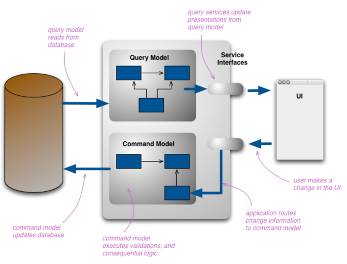

CQRS
==

시스템이 제공하는 기능
1. 상태를 변경 - 한 애그리거트의 상태를 변경
   e.g) 새로운 주문 생성, 배송지 정보 변경, 회원 암호 변경
2. 사용자 입장에서 상태 정보를 조회 - 두 개 이상의 애그리거트가 필요함.
   e.g) 주문 상세 내역 보기, 게시글 목록 보기, 판매 통계 보기

CQRS는 상태를 변경하는 명령(command)을 위한 모델과 상태를 제공하는 조회(Query)를 위한 모델을 분리하는 패턴

출처 : http://martinfowler.com/bliki/CQRS/html

명령모델로 JPA, 조회모델로 Mybatis등으로 분리해서 설계해서 사용해도 괜찮음.

명령모델과 조회모델이 서로 다른 데이터 저장소를 사용할 경우 데이터 동기화 시점에 따라 구현 방식이 달라질 수 있다. 
명령모델에서 데이터가 바뀌자마자 변경 내역을 바로 조회 모델에 반영해야 한다면 동기 이벤트와 글로벌 트랜잭션을 사용해서 실시간으로 동기화 할 수 있다. 
단, 전반적인 성능(응답 속도와 처리량)이 떨어지는 단점이 있다.

그래서 서로 다른 저장소의 데이터를 특정 시간 안에만 동기화해도 된다면 비동기로 데이터를 전송하면 된다.

일반적인 웹 서비스는 상태 변경보다 조회하는 요청이 훨씬 많다.

- 쿼리를 최적화해서 쿼리 실행 속도 자체를 높이기
- 조회 전용 저장소를 따로 사용하기

장점 : 캐시 기술을 적용 했기 때문에 조회 처리량을 대폭 늘릴 수 있고 명령 모델에 영향을 주지 않음. 
단점 : 코드가 많아짐, 비용 향상, 더 많은 구현 기술이 필요함.
